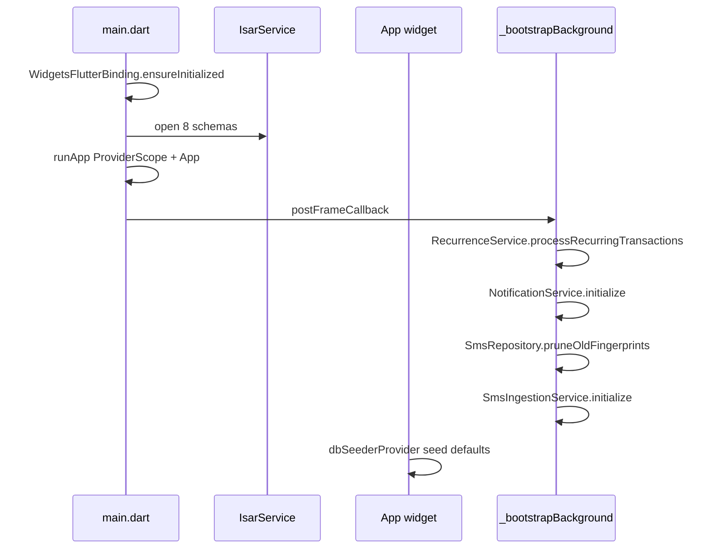
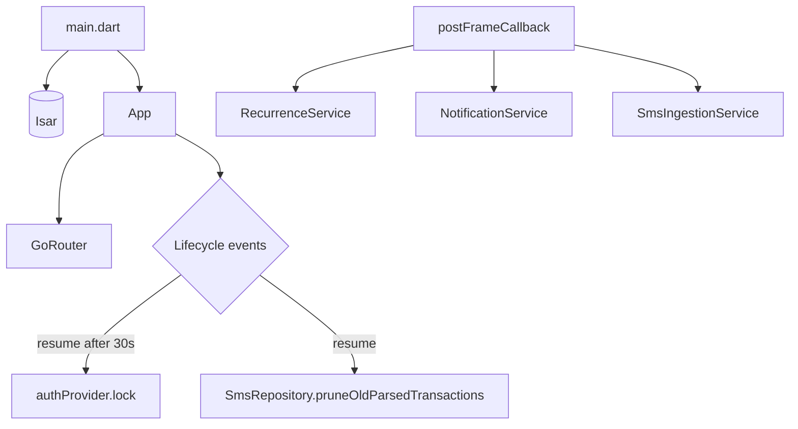

# Bootstrap and Lifecycle

## Purpose

Documents how the app starts, what runs before the first frame, what runs after, and how lifecycle events (background/resume) trigger security and maintenance work.

## Entry points

| File | Role |
|------|------|
| [`lib/main.dart`](../../../lib/main.dart) | Sync bootstrap: Isar + ProviderScope |
| [`lib/app.dart`](../../../lib/app.dart) | Widget tree, lifecycle observer, auto-lock |

## Startup sequence



### Phase 1 — Blocking (before first frame)

1. `WidgetsFlutterBinding.ensureInitialized()`
2. `IsarService.open(...)` with all 8 collection schemas
3. `runApp(ProviderScope(overrides: [isarProvider], child: App()))`

User sees UI as soon as the first frame renders — background work does not block this.

### Phase 2 — Post-frame background (`_bootstrapBackground`)

Non-fatal; errors swallowed individually:

| Task | Class | Purpose |
|------|-------|---------|
| Recurrence catch-up | `RecurrenceService` | Materialize due recurring transactions |
| Notifications init | `NotificationService.instance` | Schedule local notifications |
| SMS fingerprint prune | `SmsRepository.pruneOldFingerprints` | Dedup table maintenance |
| SMS wiring | `SmsIngestionService.initialize` | Platform channel + parse pipeline |

### Phase 3 — App widget init

In `App.initState`:

- Register `WidgetsBindingObserver`
- Trigger `dbSeederProvider` — seeds default categories and accounts on first launch

## Lifecycle behavior

`App` implements `WidgetsBindingObserver.didChangeAppLifecycleState`:

| State | Action |
|-------|--------|
| `paused` / `hidden` | Record `_backgroundedAt`; iOS privacy overlay |
| `inactive` (iOS) | Show privacy overlay |
| `resumed` | Hide overlay; auto-lock if backgrounded ≥ 30s; prune SMS history |

### Auto-lock

- Duration: `_autoLockDuration = 30 seconds`
- On resume, if elapsed ≥ 30s → `authProvider.notifier.lock()`
- Does **not** trigger on `inactive` alone (avoids lock during biometric sheet)

### iOS privacy overlay

When backgrounding, a full-screen lock icon overlay prevents task-switcher snapshots from showing balances. Android uses `FLAG_SECURE` in `MainActivity.kt` instead.

### SMS history prune on resume

`_pruneSmsHistory()` calls `SmsRepository.pruneOldParsedTransactions()` — keeps parsed SMS table from growing indefinitely. Swallows errors in tests where Isar may be unavailable.

## Data flow



## Dependencies

| Module | Interaction |
|--------|-------------|
| [core/database](../core/database.md) | Isar open + provider override |
| [core/notifications](../core/notifications.md) | Background init |
| [core/sms/ingestion-and-policy](../core/sms/ingestion-and-policy.md) | SMS service init |
| [features/transactions](../features/transactions.md) | RecurrenceService, dbSeeder |
| [features/auth](../features/auth.md) | Auto-lock |
| [features/sms](../features/sms.md) | SMS prune |

## How to extend

### Add a new background bootstrap task

Add to `_bootstrapBackground` in `main.dart` inside its own try/catch:

```dart
try {
  await MyService.initialize(isar);
} catch (_) {/* swallow — non-fatal */}
```

Keep tasks **non-blocking** for first paint. Heavy work belongs here, not before `runApp`.

### Add resume maintenance

Add to the `AppLifecycleState.resumed` branch in `app.dart`, wrapped in try/catch:

```dart
unawaited(_myMaintenanceTask());
```

## Tests

Lifecycle and bootstrap are primarily covered indirectly:

| Test | Coverage |
|------|----------|
| `test/unit/auth/auth_provider_test.dart` | Lock/unlock |
| `test/unit/sms/sms_repository_privacy_test.dart` | SMS prune |
| Widget tests | App renders under `ProviderScope` overrides |

```bash
flutter test test/unit/auth/auth_provider_test.dart
```

For integration testing of bootstrap, use `integration_test/` (if added) or manual device verification.

## Related docs

- [overview.md](overview.md) — Architecture
- [navigation-and-auth.md](navigation-and-auth.md) — Lock screen routing
- [../platform/android-sms-listener.md](../platform/android-sms-listener.md) — SMS platform wiring
- [../core/sms/ingestion-and-policy.md](../core/sms/ingestion-and-policy.md) — Ingestion init
