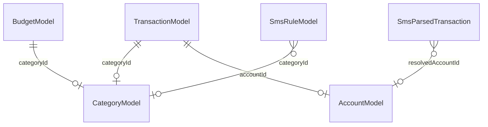
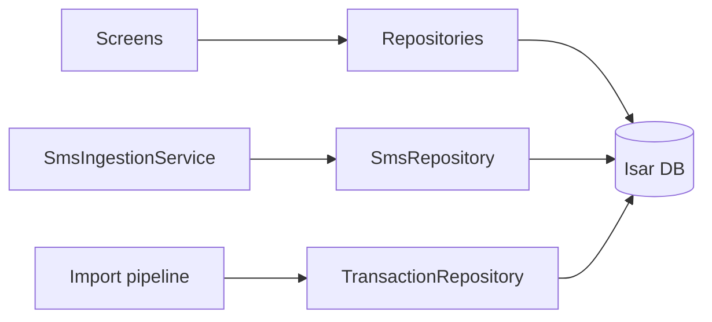

# Data Model

## Purpose

All persistent app data lives in a single **Isar** database (`money_manager`) opened at startup. Eight `@collection` types span transactions, budgets, goals, and SMS. There is no remote sync layer today — `userId` fields are reserved for future use.

## Entry points

| Location | Role |
|----------|------|
| [`lib/main.dart`](../../../lib/main.dart) | Registers all 8 schemas with `IsarService.open` |
| [`lib/core/database/isar_service.dart`](../../../lib/core/database/isar_service.dart) | Singleton open + `isarProvider` |

## Collections

| Collection | Feature module | File |
|------------|----------------|------|
| `TransactionModel` | transactions | [`transaction_model.dart`](../../../lib/features/transactions/data/models/transaction_model.dart) |
| `CategoryModel` | transactions | [`category_model.dart`](../../../lib/features/transactions/data/models/category_model.dart) |
| `AccountModel` | transactions | [`account_model.dart`](../../../lib/features/transactions/data/models/account_model.dart) |
| `BudgetModel` | budgets | [`budget_model.dart`](../../../lib/features/budgets/data/models/budget_model.dart) |
| `GoalModel` | goals | [`goal_model.dart`](../../../lib/features/goals/data/models/goal_model.dart) |
| `SmsParsedTransaction` | sms | [`sms_parsed_transaction.dart`](../../../lib/features/sms/data/models/sms_parsed_transaction.dart) |
| `SmsRuleModel` | sms | [`sms_rule_model.dart`](../../../lib/features/sms/data/models/sms_rule_model.dart) |
| `SmsRawLogModel` | sms | [`sms_raw_log_model.dart`](../../../lib/features/sms/data/models/sms_raw_log_model.dart) |

## Relationships



### TransactionModel (central entity)

Key fields:

- `amount`, `isIncome`, `date` — core transaction data
- `categoryId`, `accountId` — indexed FK-style links (not Isar links)
- `recurrence`, `entryType` — recurring and transfer semantics
- `transferGroupId` — pairs account-to-account transfer rows
- `importBatchId` — ties rows to an import session
- `currencyCode`, `originalAmount`, `fxRate` — multi-currency import support
- `isDeleted` — soft delete

### CategoryModel / AccountModel

Owned by the transactions feature. Categories include name, icon, color, type (income/expense). Accounts include name, type, balance tracking flags.

> Categories are **not** in `lib/features/categories/` — that folder is empty. All category code lives under `lib/features/transactions/`.

### BudgetModel

Links to a category via `categoryId`. Stores limit amount and period.

### GoalModel

Self-contained savings target: name, target amount, current amount, deadline.

### SMS collections

| Model | Purpose |
|-------|---------|
| `SmsParsedTransaction` | Parsed SMS fields, fingerprint dedup, review/auto-add status |
| `SmsRuleModel` | User-defined merchant → category rules |
| `SmsRawLogModel` | Optional raw SMS audit log (privacy-sensitive) |

## Data flow



Repositories encapsulate all reads/writes. Providers expose streams/futures to the UI.

## Dependencies

- **Isar codegen:** run after model changes:
  ```bash
  flutter pub run build_runner build --delete-conflicting-outputs
  ```
- **Seeding:** default categories/accounts seeded via `dbSeederProvider` in [`transaction_providers.dart`](../../../lib/features/transactions/domain/providers/transaction_providers.dart) on first launch.

## How to extend

### Add a field to an existing collection

1. Add the field to the `@collection` class.
2. Run `build_runner`.
3. Update repository read/write paths and any UI that displays the field.
4. Add a migration note if the field is required (Isar handles optional new fields gracefully).

### Add a new collection

1. Create `lib/features/<feature>/data/models/my_model.dart` with `@collection`.
2. Run `build_runner`.
3. Add `MyModelSchema` to the list in `main.dart`.
4. Create repository + providers.
5. Update this doc and [overview.md](overview.md).

Example schema registration:

```dart
final isar = await IsarService.open([
  TransactionModelSchema,
  // ... existing schemas
  MyModelSchema,
]);
```

## Tests

| Area | Test files |
|------|------------|
| Transactions | `test/unit/transactions/transaction_repository_test.dart` |
| Goals | `test/unit/goals/goal_model_test.dart` |
| Budgets | `test/unit/budgets/budget_calculations_test.dart` |
| SMS privacy | `test/unit/sms/sms_repository_privacy_test.dart` |

```bash
flutter test test/unit/transactions/
flutter test test/unit/sms/sms_repository_privacy_test.dart
```

## Related docs

- [overview.md](overview.md) — Architecture patterns
- [../core/database.md](../core/database.md) — Isar service
- [../features/transactions.md](../features/transactions.md) — Transaction domain
- [../features/sms.md](../features/sms.md) — SMS persistence
