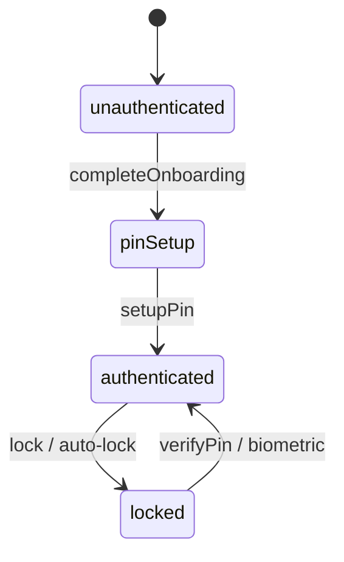
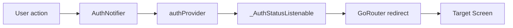

# Navigation and Auth

## Purpose

Navigation is centralized in **GoRouter** with an auth-aware redirect guard. Authenticated users live inside a **5-tab shell** (Home, Transactions, Budgets, Analytics, Settings). Additional routes (goals, SMS, import, etc.) render inside the shell without highlighting a tab.

## Entry points

| File | Role |
|------|------|
| [`lib/core/router/app_router.dart`](../../../lib/core/router/app_router.dart) | Router, shell, redirects |
| [`lib/core/router/app_routes.dart`](../../../lib/core/router/app_routes.dart) | Path and name constants |
| [`lib/features/auth/providers/auth_provider.dart`](../../../lib/features/auth/providers/auth_provider.dart) | Auth state driving redirects |

## Auth status model

[`AuthStatus`](../../../lib/features/auth/domain/auth_state.dart):

| Status | Meaning |
|--------|---------|
| `unauthenticated` | Onboarding not complete |
| `pinSetup` | Onboarding done, PIN not yet set |
| `locked` | PIN set, session locked |
| `authenticated` | Unlocked session |

## Redirect matrix

Public paths (no auth required): `/`, `/onboarding`, `/onboarding/currency`, `/onboarding/profile`, `/onboarding/pin`, `/lock`.

| Current status | Protected route access | Redirect to |
|----------------|------------------------|-------------|
| `unauthenticated` | any protected | `/onboarding` |
| `pinSetup` | any protected | `/onboarding/pin` |
| `locked` | any protected | `/lock` |
| `authenticated` | public (except splash) | `/home` |
| `authenticated` | protected | allow |
| auth loading | any | no redirect (wait) |
| auth error | protected | `/lock` (fail closed) |



## Shell navigation

Bottom nav tabs (`_AppShell`):

| Index | Tab | Path |
|-------|-----|------|
| 0 | Home | `/home` |
| 1 | Transactions | `/transactions` |
| 2 | Budgets | `/budgets` |
| 3 | Analytics | `/analytics` |
| 4 | Settings | `/settings` |

Routes inside shell but **without tab highlight** (index falls back to 0):

- `/goals`, `/goals/:id`
- `/insights`
- `/settings/home-layout`, `/settings/categories`, `/settings/accounts`, `/settings/reconciliation`
- `/settings/import`, `/settings/import/preview`, `/settings/import/summary`
- `/sms/inbox`, `/sms/onboarding`, `/sms/settings`
- `/analytics/category/:id`
- `/dev/theme` (debug only)

## Route table

| Path | Name | Screen |
|------|------|--------|
| `/` | splash | SplashScreen |
| `/onboarding` | onboarding | OnboardingScreen |
| `/onboarding/currency` | currency-setup | CurrencySetupScreen |
| `/onboarding/profile` | profile-setup | ProfileSetupScreen |
| `/onboarding/pin` | pin-setup | PinSetupScreen |
| `/lock` | pin-lock | PinLockScreen |
| `/home` | dashboard | DashboardScreen |
| `/transactions` | transactions | TransactionsScreen |
| `/budgets` | budgets | BudgetsScreen |
| `/analytics` | analytics | AnalyticsScreen |
| `/analytics/category/:id` | analytics-category | CategoryDetailScreen |
| `/goals` | goals | GoalsScreen |
| `/goals/:id` | goal-detail | GoalDetailScreen |
| `/insights` | insights | InsightsScreen |
| `/settings` | settings | SettingsScreen |
| `/settings/home-layout` | home-layout | HomeLayoutScreen |
| `/sms/inbox` | sms-inbox | SmsInboxScreen |
| `/sms/onboarding` | sms-onboarding | SmsOnboardingScreen |
| `/sms/settings` | sms-settings | SmsSettingsScreen |
| `/settings/categories` | manage-categories | ManageCategoriesScreen |
| `/settings/accounts` | manage-accounts | ManageAccountsScreen |
| `/settings/accounts/:id` | account-detail | AccountDetailScreen |
| `/settings/reconciliation` | reconciliation | ReconciliationScreen |
| `/settings/import` | import-data | ImportScreen |
| `/settings/import/preview` | import-preview | ImportPreviewScreen |
| `/settings/import/summary` | import-summary | ImportSummaryScreen |
| `/dev/theme` | theme-showcase | ThemeShowcaseScreen (debug) |

Invalid integer IDs in deep links render `_RouteNotFoundScreen` instead of crashing.

## Back button behavior

Handled by `AppBackHandler` (`lib/core/navigation/app_back_handler.dart`):

- **Shell (main app):** pop nested route if `GoRouter.canPop()` → else non-home bottom-nav tab → `/home` → else exit confirmation → `SystemNavigator.pop()`
- **Outside shell** (splash, onboarding, PIN lock, etc.): pop if possible → else exit confirmation
- **Shell:** `PopScope(canPop: false)` on `_AppShell`
- **Outside shell:** `PopScope(canPop: false)` in `App` `MaterialApp.router` builder (inner shell `PopScope` wins when both are mounted)

## Data flow



`routerProvider` is a Riverpod `Provider<GoRouter>` so redirects can `ref.read(authProvider)`.

## Dependencies

- **auth feature** — PIN, biometrics, secure storage
- **All feature screens** — imported directly in `app_router.dart` (no feature-owned route tables)

## How to extend

### Add a new route

1. Add constants to `AppRoutes` / `AppRouteNames` in `app_routes.dart`.
2. Add `GoRoute` inside the appropriate `ShellRoute` (or outside for public routes).
3. Update this doc's route table.
4. Navigate with `context.go(AppRoutes.myRoute)` or `context.pushNamed(...)`.

Example:

```dart
GoRoute(
  path: AppRoutes.myFeature,
  name: AppRouteNames.myFeature,
  builder: (_, __) => const MyFeatureScreen(),
),
```

### Add auth-gated behavior

Read `ref.watch(authProvider)` or `isAuthenticatedProvider` in screens. Do **not** bypass the router redirect for protected data — add the path to the redirect logic if it must be gated.

## Tests

| Test | Path |
|------|------|
| PIN lock screen | `test/widgets/pin_lock_screen_test.dart` |
| Auth provider | `test/unit/auth/auth_provider_test.dart` |

```bash
flutter test test/unit/auth/
flutter test test/widgets/pin_lock_screen_test.dart
```

## Related docs

- [bootstrap-and-lifecycle.md](bootstrap-and-lifecycle.md) — Auto-lock on background
- [../features/auth.md](../features/auth.md) — PIN, lockout, biometrics
- [../features/onboarding.md](../features/onboarding.md) — First-run flow
