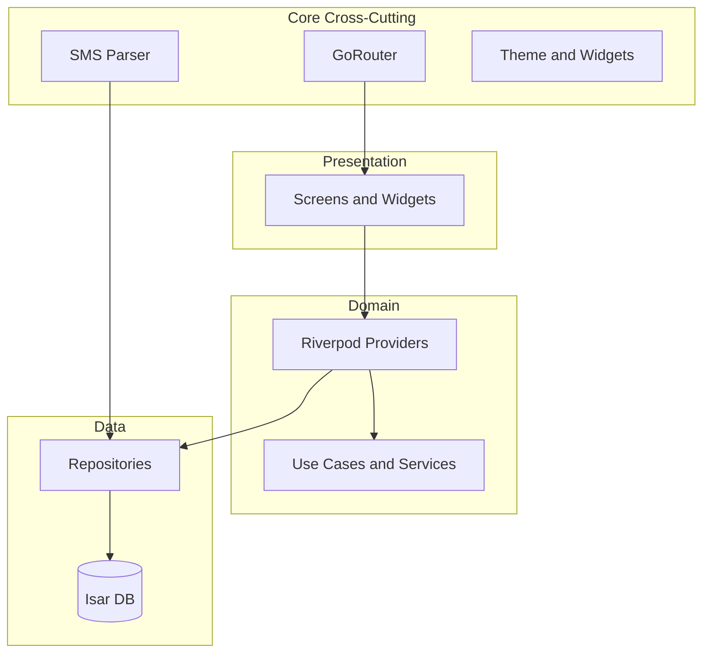

# Architecture Overview

## Purpose

Money Manager is a **local-first** personal finance app built with Flutter 3+. All user data lives in an on-device Isar database. The codebase follows **Clean Architecture** with a **feature-first** folder layout, **Riverpod** for state management, and **GoRouter** for navigation.

## Entry points

| File | Role |
|------|------|
| [`lib/main.dart`](../../../lib/main.dart) | Opens Isar, runs `ProviderScope`, post-frame bootstrap |
| [`lib/app.dart`](../../../lib/app.dart) | Root `MaterialApp.router`, lifecycle, auto-lock, privacy overlay |
| [`lib/core/router/app_router.dart`](../../../lib/core/router/app_router.dart) | GoRouter definition and shell |

## Folder map

```text
lib/
├── main.dart, app.dart          # App bootstrap
├── core/                        # Cross-cutting infra (DB, router, SMS engine, theme, widgets)
├── features/                    # Feature modules (data / domain / presentation)
└── l10n/                        # Generated localizations (app_en.arb)
```

### Feature module layout (canonical)

Most features use three layers:

| Layer | Responsibility | Typical contents |
|-------|----------------|------------------|
| `data/` | Persistence, IO | Isar `@collection` models, repositories, parsers |
| `domain/` | Business logic | Riverpod providers, use cases, domain models |
| `presentation/` | UI | Screens, widgets, sheets |

**Exceptions** (documented in their feature docs):

- **auth** — `providers/` at feature root (not under `domain/`)
- **onboarding** — `presentation/` only
- **import** — services/parsers in `data/` without a repository abstraction
- **analytics / insights** — no `data/` layer; read via providers from transactions

## Key types and patterns

### Riverpod

| Pattern | Example | Use when |
|---------|---------|----------|
| `Provider` | `isarProvider`, `routerProvider` | Singletons, services |
| `AsyncNotifierProvider` | `authProvider` | Async state with mutations |
| `StreamProvider` / `FutureProvider.family` | Transaction lists, detail by ID | Reactive DB reads |
| `ProviderScope` overrides | `isarProvider` in `main.dart` | Inject opened DB instance |

### Isar

- Models use `@collection` in `features/*/data/models/`.
- Codegen produces `*.g.dart` — run `build_runner` after model changes.
- All schemas registered once in `main.dart` via `IsarService.open(...)`.

### Imports

Use `package:money_manager/...` for all `lib/` imports (no relative imports across features).

## Data flow



Typical read path: **Screen** watches a **Provider** → provider calls **Repository** → repository queries **Isar** → UI rebuilds.

Typical write path: **Screen** calls **Notifier/Repository** → Isar write → stream/future provider invalidates or emits → UI updates.

## Dependencies

| Upstream | Downstream consumers |
|----------|---------------------|
| `core/database` | Every feature with persistence |
| `core/router` | All screens |
| `features/auth` | Router redirect guard |
| `features/transactions` | Dashboard, analytics, budgets, import, SMS |
| `core/sms` | `features/sms`, Android platform layer |

## How to extend

### Add a new feature module

1. Create `lib/features/my_feature/{data,domain,presentation}/`.
2. Add Isar model (if needed) + register schema in `main.dart`.
3. Add providers in `domain/providers/`.
4. Add screen(s) and register routes in `app_router.dart`.
5. Add module doc at `dev/docs/features/my_feature.md` and link from [README.md](../README.md).

### Add a provider

```dart
// lib/features/my_feature/domain/providers/my_providers.dart
final myListProvider = StreamProvider<List<MyModel>>((ref) {
  final isar = ref.watch(isarProvider);
  return MyRepository(isar).watchAll();
});
```

## Tests

Architecture-level tests are distributed by feature under `test/unit/`. No dedicated architecture test file.

```bash
flutter test test/unit/
dart analyze lib/
```

## Related docs

- [data-model.md](data-model.md) — Isar collections
- [navigation-and-auth.md](navigation-and-auth.md) — Routing and auth gates
- [bootstrap-and-lifecycle.md](bootstrap-and-lifecycle.md) — App startup and lifecycle
- [../core/database.md](../core/database.md) — Isar setup
