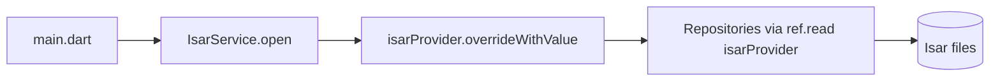

# Core — Database

## Purpose

Provides a singleton **Isar** database wrapper and the Riverpod `isarProvider` used by all repositories. Ensures the DB is opened once before any feature code accesses it.

## Entry points

| File | Role |
|------|------|
| [`lib/core/database/isar_service.dart`](../../../lib/core/database/isar_service.dart) | `IsarService.open`, `isarProvider` |
| [`lib/main.dart`](../../../lib/main.dart) | Opens DB and overrides provider |

## Folder map

```text
lib/core/database/
└── isar_service.dart
```

## Key types

| Symbol | Description |
|--------|-------------|
| `IsarService` | Static singleton — `open()` and `instance` getter |
| `isarProvider` | `Provider<Isar>` — must be overridden in `main.dart` |

Database file: `{appDocuments}/money_manager.isar`

## Data flow



## Dependencies

- **path_provider** — application documents directory
- **isar / isar_flutter_libs** — embedded database
- All feature repositories depend on `isarProvider`

## How to extend

### Register a new schema

1. Create `@collection` model + run `build_runner`.
2. Add schema to `IsarService.open([...])` in `main.dart`.
3. Inject via `ref.read(isarProvider)` in new repository.

```dart
final isar = await IsarService.open([
  TransactionModelSchema,
  MyNewModelSchema,
]);

runApp(
  ProviderScope(
    overrides: [isarProvider.overrideWithValue(isar)],
    child: const App(),
  ),
);
```

### Access in a provider

```dart
final myRepoProvider = Provider((ref) {
  return MyRepository(ref.watch(isarProvider));
});
```

## Tests

Override `isarProvider` in widget/unit tests with an in-memory or temp Isar instance via `ProviderScope(overrides: [...])`.

```bash
flutter test test/unit/transactions/transaction_repository_test.dart
```

## Related docs

- [../architecture/data-model.md](../architecture/data-model.md) — Collections
- [../architecture/bootstrap-and-lifecycle.md](../architecture/bootstrap-and-lifecycle.md) — Startup
