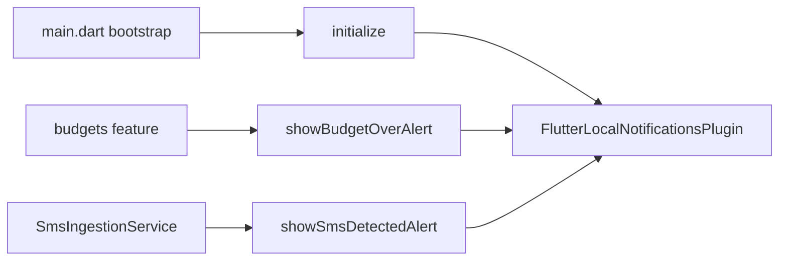

# Core — Notifications

## Purpose

Wraps **flutter_local_notifications** for budget over-limit alerts and SMS auto-detection notifications. Initialized during post-frame bootstrap in `main.dart`.

## Entry points

| File | Role |
|------|------|
| [`lib/core/notifications/notification_service.dart`](../../../lib/core/notifications/notification_service.dart) | Singleton service |
| [`lib/main.dart`](../../../lib/main.dart) | `NotificationService.instance.initialize()` |

## Folder map

```text
lib/core/notifications/
└── notification_service.dart
```

## Key types

| Method | Channel | When |
|--------|---------|------|
| `initialize()` | — | App startup |
| `showBudgetOverAlert(...)` | `budget_alerts` | Budget exceeded |
| `showSmsDetectedAlert(...)` | `sms_detections` | SMS parsed and queued |

Singleton: `NotificationService.instance`

## Data flow



## Dependencies

- **flutter_local_notifications**
- Called from [sms/ingestion-and-policy.md](sms/ingestion-and-policy.md) and budgets feature

## How to extend

### Add a new notification type

1. Define channel ID/name constants in `notification_service.dart`.
2. Add a `showXxx` method with `AndroidNotificationDetails` + `DarwinNotificationDetails`.
3. Call from the feature after the triggering event.
4. Request permissions in `initialize()` if Android 13+ requires it.

## Tests

Notifications are platform-dependent — test call sites with mocks in unit tests where injected; otherwise manual device verification.

```bash
flutter test test/unit/budgets/
```

## Related docs

- [../architecture/bootstrap-and-lifecycle.md](../architecture/bootstrap-and-lifecycle.md)
- [sms/ingestion-and-policy.md](sms/ingestion-and-policy.md)
- [../features/budgets.md](../features/budgets.md)
