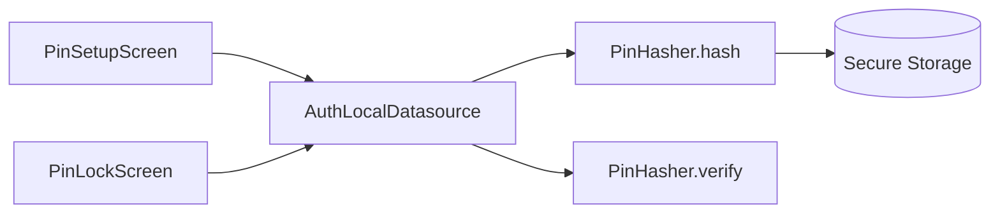

# Core — Security

## Purpose

Provides **PIN hashing** (PBKDF2-HMAC-SHA256) used by the auth feature. PINs are never stored in plaintext after setup; legacy plaintext values are migrated on first successful verify.

## Entry points

| File | Role |
|------|------|
| [`lib/core/security/pin_hasher.dart`](../../../lib/core/security/pin_hasher.dart) | Hash, verify, constant-time compare |
| [`lib/features/auth/data/auth_local_datasource.dart`](../../../lib/features/auth/data/auth_local_datasource.dart) | Persists hash via secure storage |

## Folder map

```text
lib/core/security/
└── pin_hasher.dart

lib/features/auth/          # Session, lockout, biometrics (see features/auth.md)
├── data/auth_local_datasource.dart
└── providers/auth_provider.dart
```

## Key types

| Symbol | Description |
|--------|-------------|
| `PinHasher` | `hash(pin)`, `verify(pin, storedValue)`, `isHashed` |
| Stored format | `pbkdf2$<iterations>$<base64Salt>$<base64Hash>` |
| `defaultIterations` | 100,000 PBKDF2 iterations |

Security boundaries:

- **flutter_secure_storage** — PIN hash, lockout counters, onboarding flags
- **local_auth** — Biometric unlock (feature layer)
- **Auto-lock** — 30s background → locked (`app.dart`)

## Data flow



## Dependencies

- **crypto** package — HMAC-SHA256 for PBKDF2
- **features/auth** — sole consumer of `PinHasher`

## How to extend

### Change PIN length

Update [`AuthConfig.pinLength`](../../../lib/features/auth/domain/auth_config.dart) only — not per-screen literals. Grep for duplicated digit counts after changing.

### Upgrade hash parameters

If increasing iterations, `PinHasher.verify` still reads iteration count from stored string. New PINs use `defaultIterations`; existing PINs verify with stored iteration value.

## Tests

```bash
flutter test test/unit/security/pin_hasher_test.dart
flutter test test/unit/auth/auth_datasource_test.dart
flutter test test/unit/auth/auth_provider_test.dart
```

## Related docs

- [../features/auth.md](../features/auth.md) — Lockout, biometrics, auth flow
- [../architecture/navigation-and-auth.md](../architecture/navigation-and-auth.md) — Route guards
