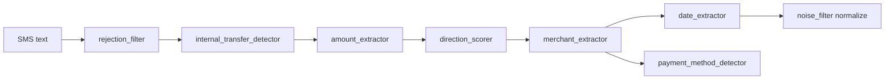

# Core SMS — Extraction Modules

## Purpose

Tiered, single-responsibility extractors under `lib/core/sms/extraction/`. Each module handles one aspect of parsing Indian bank SMS templates. Called in a fixed order by [`TransactionParser`](../../../../lib/core/sms/transaction_parser.dart).

## Entry points

All modules are invoked from `TransactionParser.parse()` — not called directly from UI.

## Module reference

| Module | File | Role |
|--------|------|------|
| Rejection | [`rejection_filter.dart`](../../../../lib/core/sms/extraction/rejection_filter.dart) | Drop OTP, promos, non-transaction messages |
| Internal transfer | [`internal_transfer_detector.dart`](../../../../lib/core/sms/extraction/internal_transfer_detector.dart) | Skip multi-leg / self-transfer SMS |
| Amount | [`amount_extractor.dart`](../../../../lib/core/sms/extraction/amount_extractor.dart) | Rs/INR/₹ amounts near debit/credit verbs |
| Direction | [`direction_scorer.dart`](../../../../lib/core/sms/extraction/direction_scorer.dart) | Income vs expense vs ambiguous + confidence |
| Merchant | [`merchant_extractor.dart`](../../../../lib/core/sms/extraction/merchant_extractor.dart) | Priority-ordered counterparty extraction |
| Date | [`date_extractor.dart`](../../../../lib/core/sms/extraction/date_extractor.dart) | Transaction date from body |
| Noise | [`noise_filter.dart`](../../../../lib/core/sms/extraction/noise_filter.dart) | Normalize merchant keys for dedup/rules |
| Payment method | [`payment_method_detector.dart`](../../../../lib/core/sms/extraction/payment_method_detector.dart) | UPI, card, NEFT, etc. |
| Subscription | [`subscription_detector.dart`](../../../../lib/core/sms/extraction/subscription_detector.dart) | Recurring charge hints (optional) |

## Merchant extraction priority

`SmsMerchantExtractor` tries patterns in order (first match wins):

1. UPI `to` / paid to / sent to (with negative lookahead for `to your/account`)
2. `debited for`, membership fee, `for … order`
3. `credited … by`, `spent … at`, `at MERCHANT`
4. `from` party, beneficiary, Info.VPS block
5. Name-before-credited (`Beena Hotel credited`)

**Pitfalls** (from project rules):

- Amount regex must use `\d+(?:,\d{2,3})*(?:\.\d{1,2})?` — not `\d{1,3}` alone
- Use `(?<![A-Za-z])to\s+` so `ZOMATO` does not match internal `TO `
- Run `beneficiary` before `nameBeforeCredited` to avoid `has been` noise

## Direction scoring

`SmsDirectionScorer.detect` returns:

- `TransactionDirection` (income / expense / ambiguous)
- `confidence` (0–1)
- `matchedSignals` — comma-separated for debugging

Card phrases like `using Debit Card` are stripped on raw text before scoring when needed.

## Data flow



## Dependencies

- [`sms_parser_types.dart`](../../../../lib/core/sms/sms_parser_types.dart) — shared enums
- Corpus tests — [testing/sms-corpus.md](../../testing/sms-corpus.md)

## How to extend

### Add a new merchant pattern

1. Add `RegExp` to `merchant_extractor.dart` in the priority list.
2. Return `MerchantExtractionResult` with appropriate `MerchantExtractionSource`.
3. Add corpus JSON row with redacted real SMS.
4. Run corpus test.

Example test-driven workflow:

```bash
dart run dev/tool/corpus_debug.dart --id my_new_fixture   # if tool supports filtering
flutter test test/unit/sms/transaction_parser_corpus_test.dart
```

## Tests

```bash
flutter test test/unit/sms/transaction_parser_test.dart
flutter test test/unit/sms/transaction_parser_corpus_test.dart
```

Every new template family needs a corpus fixture **before** shipping regex changes.

## Related docs

- [overview.md](overview.md)
- [gap-analysis.md](gap-analysis.md)
- `.cursor/rules/sms-merchant-extraction.mdc`
