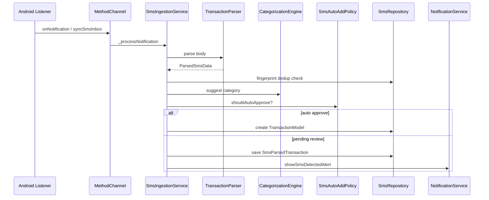

# Core SMS — Ingestion and Policy

## Purpose

Coordinates the **end-to-end SMS pipeline** after platform delivery: validate → parse → dedup → categorize → apply auto-add policy → persist → notify. Bridges Android MethodChannel, core parser, and `features/sms` repository.

## Entry points

| File | Role |
|------|------|
| [`lib/core/sms/sms_ingestion_service.dart`](../../../../lib/core/sms/sms_ingestion_service.dart) | Main coordinator |
| [`lib/main.dart`](../../../../lib/main.dart) | `SmsIngestionService(...).initialize()` post-frame |
| [`lib/core/sms/sms_auto_add_policy.dart`](../../../../lib/core/sms/sms_auto_add_policy.dart) | Auto-approve rules |
| [`lib/core/sms/sms_account_resolver.dart`](../../../../lib/core/sms/sms_account_resolver.dart) | Map account hint → `AccountModel` |

Method channel: `AppConfig.smsMethodChannel` (`com.rapps.moneymanager/sms`)

## Folder map

```text
lib/core/sms/
├── sms_ingestion_service.dart
├── sms_auto_add_policy.dart
├── sms_account_resolver.dart
├── transaction_parser.dart
└── categorization_engine.dart
```

## Key types

| Symbol | Description |
|--------|-------------|
| `SmsIngestionService` | `initialize`, `syncInbox`, `approve`, `_processNotification` |
| `SmsAutoAddPolicy.shouldAutoApprove` | Uses `SmsSettings`, confidence thresholds, user rules |
| `SmsAccountResolver.resolve` | Last-4 hint → account; fallback default account |
| `CategorizationEngine` | Suggest category from merchant + rules |
| Rate limit | 20 events / 60 seconds (live notifications) |

### Auto-add modes (`SmsAutoAddMode`)

| Mode | Behavior |
|------|----------|
| `askAlways` | Never auto-approve |
| `autoAddKnown` | Auto when user rule exists and merchant known |
| `silentAll` | Auto when rule exists OR category confidence ≥ 0.90 |

Requires direction + category confidence ≥ user threshold (`confidenceThreshold / 100`).

## Ingestion flow



## Platform methods (Android)

| Method | Direction | Purpose |
|--------|-----------|---------|
| `isNotificationListenerEnabled` | Dart → native | Check listener permission |
| `openNotificationSettings` | Dart → native | Open system settings |
| `syncActiveNotifications` | Dart → native | Backfill from active notifications |
| `syncSmsInbox` | Dart → native | Read SMS inbox (with permission) |
| Handler on channel | native → Dart | New notification payload |

See [platform/android-sms-listener.md](../../platform/android-sms-listener.md).

## Dependencies

- [overview.md](overview.md) — Parser
- [../features/sms.md](../features/sms.md) — UI, settings, rules
- [../notifications.md](../notifications.md) — Detection alerts
- [../features/transactions.md](../features/transactions.md) — Created transactions

## How to extend

### Change auto-add logic

Edit `SmsAutoAddPolicy.shouldAutoApprove` — add tests in `test/unit/sms/sms_auto_add_policy_test.dart`.

### Add a new platform callback

1. Handle in `SmsListenerService.kt` / `MainActivity.kt`.
2. Add case in `_onMethodCall` in `sms_ingestion_service.dart`.
3. Document in platform doc.

### Manual approve from inbox

Use `SmsIngestionService.approve(pending, categoryId, accountId)` — creates `TransactionModel` and updates parsed row status.

## Tests

```bash
flutter test test/unit/sms/sms_auto_add_policy_test.dart
flutter test test/unit/sms/sms_repository_privacy_test.dart
flutter test test/unit/sms/transaction_parser_test.dart
```

## Related docs

- [overview.md](overview.md)
- [../features/sms.md](../features/sms.md)
- [../../platform/android-sms-listener.md](../../platform/android-sms-listener.md)
