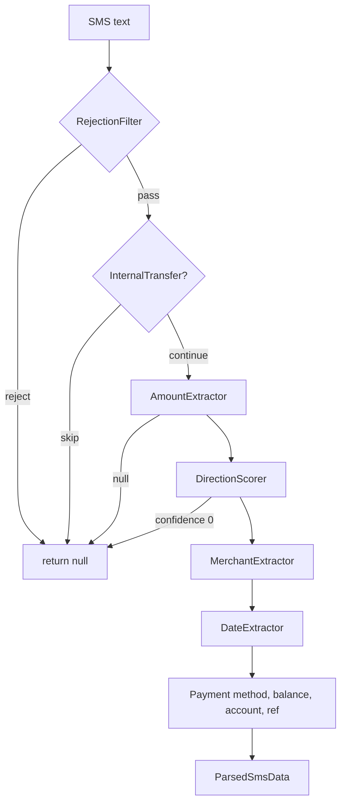

# Core SMS — Overview

## Purpose

Pure-Dart **Indian banking SMS/notification parser** that extracts amount, direction, merchant, date, payment method, and account hints from message text. Used by the ingestion pipeline before persisting to Isar.

## Entry points

| File | Role |
|------|------|
| [`lib/core/sms/transaction_parser.dart`](../../../../lib/core/sms/transaction_parser.dart) | Main orchestrator — `TransactionParser.parse` |
| [`lib/core/sms/sms_parser_types.dart`](../../../../lib/core/sms/sms_parser_types.dart) | Shared enums and result types |
| [`lib/core/sms/categorization_engine.dart`](../../../../lib/core/sms/categorization_engine.dart) | Merchant → category scoring |
| [`lib/core/sms/merchant_database.dart`](../../../../lib/core/sms/merchant_database.dart) | Known merchant → category hints |

## Folder map

```text
lib/core/sms/
├── transaction_parser.dart       # Orchestrator
├── sms_parser_types.dart
├── categorization_engine.dart
├── merchant_database.dart
├── sms_ingestion_service.dart    # See ingestion-and-policy.md
├── sms_auto_add_policy.dart
├── sms_account_resolver.dart
└── extraction/                   # See extraction-modules.md
    ├── amount_extractor.dart
    ├── date_extractor.dart
    ├── merchant_extractor.dart
    ├── direction_scorer.dart
    ├── noise_filter.dart
    ├── rejection_filter.dart
    ├── payment_method_detector.dart
    ├── internal_transfer_detector.dart
    └── subscription_detector.dart
```

## Key types

| Type | Description |
|------|-------------|
| `TransactionParser` | `parse(text)` → `ParsedSmsData?` |
| `ParsedSmsData` | amount, merchant, direction, date, accountHint, ref, balance |
| `TransactionParser.buildFingerprint` | Dedup key from amount + merchant + ref or time window |
| `TransactionParser.redactSensitive` | Mask card/account numbers for display |

## Parse pipeline



Order in `TransactionParser.parse`:

1. `SmsRejectionFilter.shouldReject`
2. `SmsInternalTransferDetector.shouldSkip`
3. `SmsAmountExtractor.extract`
4. `SmsDirectionScorer.detect`
5. `SmsMerchantExtractor.extract`
6. `SmsDateExtractor.extract`
7. Payment method, balance, account last-4, reference number
8. Optional subscription flag

## Fingerprint dedup

```dart
TransactionParser.buildFingerprint(amount, merchantNormalized, date, referenceNumber: ref);
```

- If UPI ref ≥ 8 chars → use ref in fingerprint
- Else → 5-minute time window bucket

Used by `SmsRepository` to avoid duplicate parsed rows.

## Dependencies

- **extraction/** modules — see [extraction-modules.md](extraction-modules.md)
- **features/sms** — persistence and UI
- **platform/android** — notification/SMS delivery — see [ingestion-and-policy.md](ingestion-and-policy.md)

## How to extend

### Add support for a new SMS template family

1. Add corpus fixture in `test/fixtures/sms_corpus/corpus.json`.
2. Extend the appropriate extractor (usually `merchant_extractor.dart` or `amount_extractor.dart`).
3. Run `flutter test test/unit/sms/transaction_parser_corpus_test.dart`.
4. Update [gap-analysis.md](gap-analysis.md).

See `.cursor/rules/sms-merchant-extraction.mdc` for regex pitfalls.

### Use parser in tests

```dart
const parser = TransactionParser();
final result = parser.parse('Rs 500 debited via UPI to ZOMATO on 01-01-25');
expect(result?.amount, 500);
```

## Tests

```bash
flutter test test/unit/sms/transaction_parser_test.dart
flutter test test/unit/sms/transaction_parser_corpus_test.dart
flutter test test/unit/sms/categorization_engine_test.dart
```

## Related docs

- [extraction-modules.md](extraction-modules.md)
- [ingestion-and-policy.md](ingestion-and-policy.md)
- [gap-analysis.md](gap-analysis.md)
- [../features/sms.md](../features/sms.md)
- [../testing/sms-corpus.md](../testing/sms-corpus.md)
