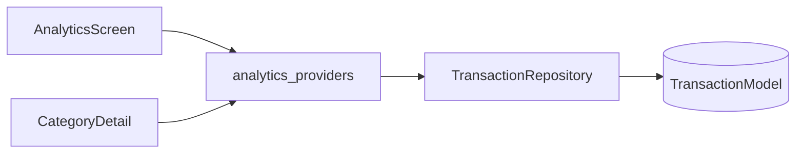

# Feature — Analytics

## Purpose

**Spending analytics** with period navigation (day/week/month/year), donut and bar charts, grouped expense lists, and category drill-down. Read-only aggregation over transactions — no dedicated data layer.

## Entry points

| Route | Screen |
|-------|--------|
| `/analytics` | `AnalyticsScreen` (bottom nav tab 3) |
| `/analytics/category/:id` | `CategoryDetailScreen` |

## Folder map

```text
lib/features/analytics/
├── domain/
│   ├── models/analytics_data.dart
│   └── providers/analytics_providers.dart
└── presentation/
    ├── screens/analytics_screen.dart, category_detail_screen.dart
    └── widgets/              # donut_chart, period_selector, date_navigator, ...
```

## Key types

| Symbol | Description |
|--------|-------------|
| `AnalyticsParams` | period + referenceDate — passed via route `extra` |
| `AnalyticsPeriod` | day, week, month, year |
| `analyticsSummaryProvider` | Aggregated income/expense by category |
| `categoryDetailProvider` | Transactions for one category in period |

## Data flow



Category detail route requires valid integer `:id` — invalid IDs show `_RouteNotFoundScreen`.

## Main providers

Defined in [`analytics_providers.dart`](../../../lib/features/analytics/domain/providers/analytics_providers.dart):

- Period selection state
- Summary streams by expense/income
- Category breakdown for charts

## Dependencies

| Module | Relationship |
|--------|--------------|
| [transactions](transactions.md) | All data |
| [auth](auth.md) | Currency |
| [core/utils](../core/utils.md) | Formatters |

## How to extend

### Add a new chart widget

1. Add widget under `presentation/widgets/`.
2. Watch existing summary provider — avoid duplicate aggregation logic.
3. Add widget test if layout is complex.

### Deep link to category

```dart
context.pushNamed(
  AppRouteNames.analyticsCategory,
  pathParameters: {'id': categoryId.toString()},
  extra: AnalyticsParams(period: AnalyticsPeriod.month, referenceDate: DateTime.now()),
);
```

## Tests

```bash
flutter test test/unit/analytics/analytics_helpers_test.dart
```

## Related docs

- [transactions.md](transactions.md)
- [insights.md](insights.md) — Higher-level trends
