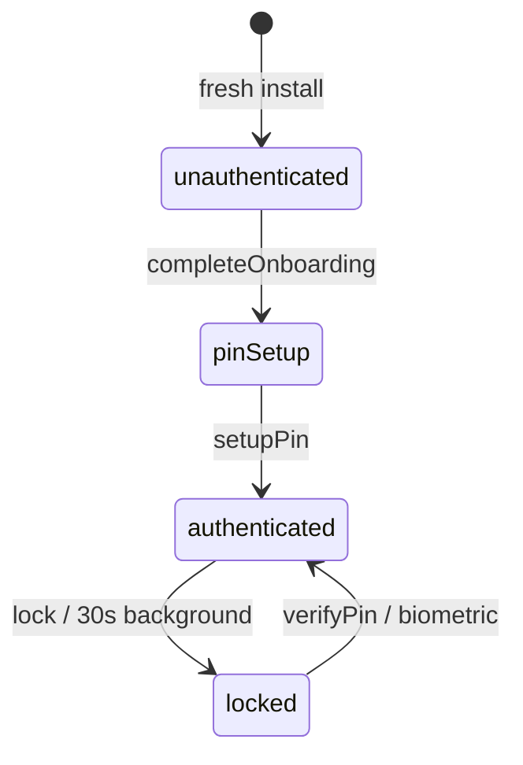
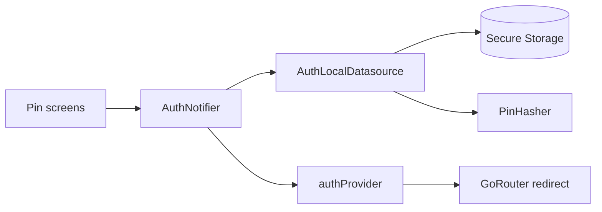

# Feature — Auth

## Purpose

Local authentication for the app: **4-digit PIN** setup and unlock, **biometric** unlock, **brute-force lockout**, and persistent user preferences (currency, profile name, theme mode). Drives the global GoRouter redirect guard — no protected screen renders without passing auth.

## Entry points

| Route | Screen |
|-------|--------|
| `/onboarding/pin` | `PinSetupScreen` |
| `/lock` | `PinLockScreen` |

Also: `ChangePinSheet` in settings (not a route).

## Folder map

```text
lib/features/auth/
├── data/
│   ├── auth_local_datasource.dart    # Secure storage + SharedPreferences
│   └── currency_data.dart            # Currency list (shared with onboarding)
├── domain/
│   ├── auth_config.dart              # PIN length SSOT
│   └── auth_state.dart               # AuthStatus enum
├── presentation/
│   ├── pin_setup_screen.dart
│   ├── pin_lock_screen.dart
│   └── pin_pad.dart
└── providers/
    └── auth_provider.dart
```

## Key types

| Symbol | Description |
|--------|-------------|
| `AuthStatus` | `unauthenticated`, `pinSetup`, `locked`, `authenticated` |
| `AuthConfig.pinLength` | 4 — use everywhere (validators, formatters, copy) |
| `AuthNotifier` | setupPin, verifyPinWithLockout, lock, biometrics |
| `PinLockoutState` | Failed attempts, escalating lockout durations |
| `AuthLocalDatasource` | Persists hash, prefs, lockout counters |

Lockout escalation (after 5 failures per cycle): 60s → 5m → 30m → 24h.

PIN hashing via [`PinHasher`](../../../lib/core/security/pin_hasher.dart) — PBKDF2-HMAC-SHA256.

## Data flow





## Main providers

| Provider | Type | Role |
|----------|------|------|
| `authProvider` | `AsyncNotifierProvider` | Current `AuthStatus` |
| `pinLockoutProvider` | `AsyncNotifierProvider` | Live lockout countdown |
| `isAuthenticatedProvider` | `Provider<bool>` | Convenience guard |
| `currencyCodeProvider` | `FutureProvider` | User currency |
| `profileNameProvider` | `FutureProvider` | Display name |

## Dependencies

| Module | Relationship |
|--------|--------------|
| [core/security](../core/security.md) | PIN hashing |
| [onboarding](onboarding.md) | Calls `completeOnboarding()` |
| [architecture/navigation-and-auth](../architecture/navigation-and-auth.md) | Redirect matrix |
| [settings](settings.md) | Change PIN, biometrics toggle |

## How to extend

### Change PIN length

1. Update **only** [`AuthConfig`](../../../lib/features/auth/domain/auth_config.dart).
2. Update `PinSetupScreen`, `PinLockScreen`, `ChangePinSheet` to read `AuthConfig.pinLength`.
3. Grep for hardcoded `4` or `6` in auth-related files.

### Add a new persisted preference

Add getter/setter to `AuthLocalDatasource`, expose via a new `FutureProvider` in `auth_provider.dart`.

## Tests

```bash
flutter test test/unit/auth/
flutter test test/unit/security/pin_hasher_test.dart
flutter test test/widgets/pin_lock_screen_test.dart
flutter test test/widgets/biometric_tile_test.dart
```

## Related docs

- [onboarding.md](onboarding.md)
- [../core/security.md](../core/security.md)
- [../architecture/navigation-and-auth.md](../architecture/navigation-and-auth.md)
- [settings.md](settings.md)
