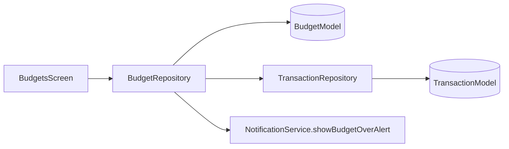

# Feature — Budgets

## Purpose

Category and overall **monthly budgets** with progress tracking, month navigation, and over-budget notifications. Reads spending from the transactions module to compute progress.

## Entry points

| Route | Screen |
|-------|--------|
| `/budgets` | `BudgetsScreen` (bottom nav tab 2) |

Set/edit budget: **`SetBudgetSheet`** (modal).

## Folder map

```text
lib/features/budgets/
├── data/
│   ├── models/budget_model.dart
│   └── repositories/budget_repository.dart
├── domain/
│   ├── providers/budget_providers.dart
│   └── usecases/budget_usecases.dart
└── presentation/
    ├── screens/budgets_screen.dart
    └── widgets/              # budget_card, set_budget_sheet
```

## Key types

| Symbol | Description |
|--------|-------------|
| `BudgetModel` | Isar entity — categoryId (nullable for overall), limit, month |
| `BudgetRepository` | CRUD + progress calculation vs transactions |
| `budgetSelectedMonthProvider` | Active month (YYYYMM encoding) |
| `BudgetProgress` | Spent vs limit for UI |

## Data flow



## Main providers

| Provider | Role |
|----------|------|
| `budgetRepositoryProvider` | Repository |
| `budgetListProvider` | Budgets for selected month |
| `budgetSelectedMonthProvider` | Month picker state |
| `budgetProgressProvider` | Spent/limit per budget |

## Dependencies

| Module | Relationship |
|--------|--------------|
| [transactions](transactions.md) | Spending totals, categories |
| [auth](auth.md) | Currency symbol |
| [core/notifications](../core/notifications.md) | Over-budget alerts |
| [dashboard](dashboard.md) | Budget health section |

## How to extend

### Add budget period type (e.g. weekly)

1. Extend `BudgetModel` with period enum.
2. Update repository progress query for new window.
3. Update month pager UI or replace with period picker.
4. Add tests in `test/unit/budgets/budget_calculations_test.dart`.

## Tests

```bash
flutter test test/unit/budgets/
```

## Related docs

- [transactions.md](transactions.md)
- [../core/notifications.md](../core/notifications.md)
- [dashboard.md](dashboard.md)
