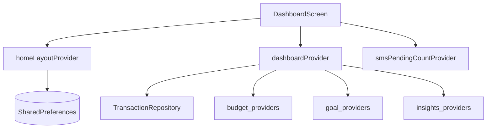

# Feature — Dashboard

## Purpose

Home screen composing configurable sections: period filter, quick stats, SMS banner, insights summary, spending ring, budget health, goals, and category spending. Shows net balance card and FAB to add transactions.

## Entry points

| Route | Screen |
|-------|--------|
| `/home` | `DashboardScreen` (bottom nav tab 0) |
| `/settings/home-layout` | `HomeLayoutScreen` |

## Folder map

```text
lib/features/dashboard/
├── data/
│   └── home_layout_repository.dart     # SharedPreferences persistence
├── domain/
│   ├── models/home_section.dart
│   └── providers/
│       ├── dashboard_providers.dart
│       └── home_layout_provider.dart
└── presentation/
    ├── screens/
    │   ├── dashboard_screen.dart
    │   └── home_layout_screen.dart
    └── widgets/
        ├── balance_card.dart
        └── spending_ring.dart
```

## Key types

### HomeSection enum

Configurable sections (toggle in Home Layout settings):

| Section | Content |
|---------|---------|
| `periodSelector` | Day/week/month/year chips |
| `quickStats` | Income/expense summary |
| `smsBanner` | Pending SMS / setup CTA |
| `insightsSummary` | Link to insights |
| `spendingRing` | Category donut chart |
| `budgetHealth` | Budget progress cards |
| `goals` | Active goals preview |
| `categorySpending` | Top categories list |

### DashboardData

Aggregated stream: income, expense, recent transactions, category summary, today/week expense — built in `dashboardProvider`.

## Data flow



## Main providers

| Provider | Role |
|----------|------|
| `homeLayoutProvider` | Enabled `Set<HomeSection>` |
| `dashboardPeriodProvider` | User period selection |
| `effectiveDashboardPeriodProvider` | Fallback when period selector hidden |
| `dashboardProvider` | `StreamProvider<DashboardData>` |

## Dependencies

| Module | Relationship |
|--------|--------------|
| [transactions](transactions.md) | Data, add transaction sheet |
| [auth](auth.md) | Profile name, currency |
| [sms](sms.md) | Pending count banner |
| [budgets](budgets.md) | Budget health section |
| [goals](goals.md) | Goals preview |
| [insights](insights.md) | Insights summary |
| [settings](settings.md) | Home layout screen link |

## How to extend

### Add a new home section

1. Add value to `HomeSection` enum in `home_section.dart`.
2. Add default enabled state in enum defaults / repository.
3. Render section in `dashboard_screen.dart` switch on enabled sections.
4. Add toggle row in `home_layout_screen.dart`.
5. Test: `home_layout_provider_test.dart`.

```dart
// dashboard_screen.dart — pattern
if (sections.contains(HomeSection.mySection)) ...[
  MySectionWidget(data: dashboardData),
],
```

## Tests

```bash
flutter test test/unit/dashboard/
flutter test test/widgets/dashboard_balance_section_test.dart
flutter test test/widgets/home_layout_screen_test.dart
```

## Related docs

- [transactions.md](transactions.md)
- [settings.md](settings.md)
- [sms.md](sms.md)
