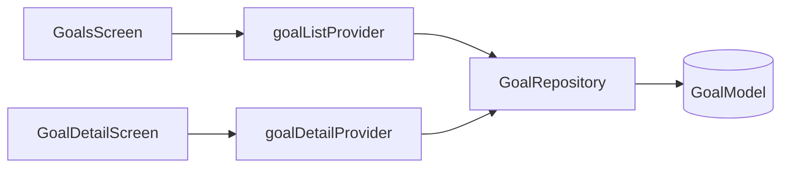

# Feature — Goals

## Purpose

**Savings goals** with target amount, current progress, deadline, and contribution history. Self-contained Isar module with list and detail screens.

## Entry points

| Route | Screen |
|-------|--------|
| `/goals` | `GoalsScreen` |
| `/goals/:id` | `GoalDetailScreen` |

Add/edit: **`AddGoalSheet`** (modal).

## Folder map

```text
lib/features/goals/
├── data/
│   ├── models/goal_model.dart
│   └── repositories/goal_repository.dart
├── domain/
│   └── providers/goal_providers.dart    # use-case providers inline
└── presentation/
    ├── screens/goals_screen.dart, goal_detail_screen.dart
    └── widgets/goal_card.dart, add_goal_sheet.dart
```

## Key types

| Symbol | Description |
|--------|-------------|
| `GoalModel` | name, targetAmount, currentAmount, deadline, color |
| `GoalRepository` | CRUD, watch streams |
| `addGoalUseCaseProvider` | Create goal |
| `addContributionUseCaseProvider` | Add amount toward target |
| `goalListProvider` | All goals stream |
| `goalDetailProvider` | Single goal by ID |

## Data flow



## Dependencies

| Module | Relationship |
|--------|--------------|
| [core/database](../core/database.md) | Isar |
| [dashboard](dashboard.md) | Goals preview section |
| [auth](auth.md) | Currency formatting |

## How to extend

### Add goal milestone notifications

1. Hook into `addContributionUseCaseProvider` after threshold crossed.
2. Schedule via `NotificationService` (add new method if needed).
3. Test contribution use case.

## Tests

```bash
flutter test test/unit/goals/goal_model_test.dart
```

## Related docs

- [../architecture/data-model.md](../architecture/data-model.md)
- [dashboard.md](dashboard.md)
