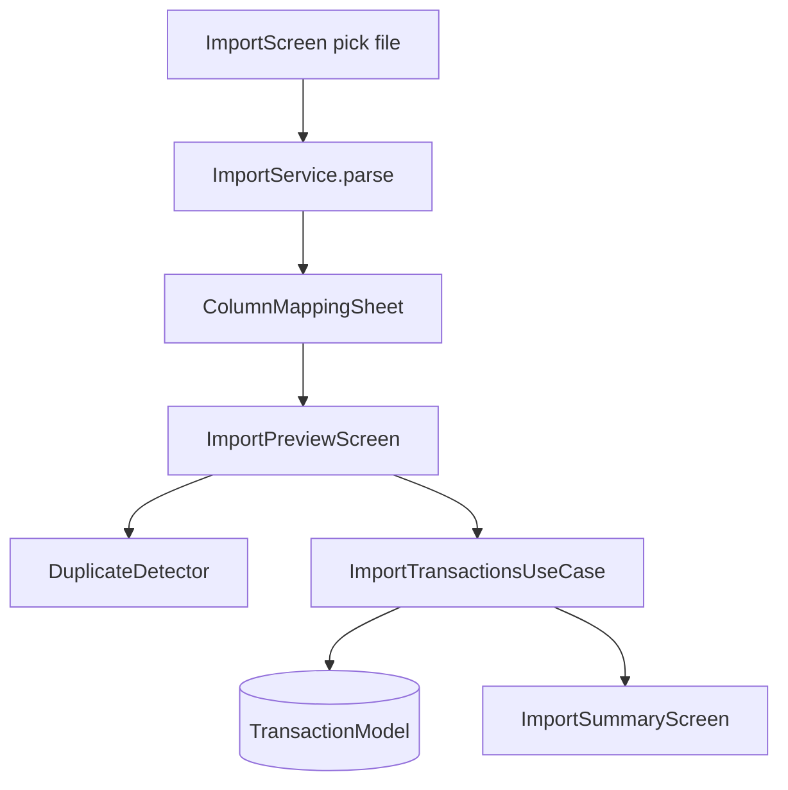

# Feature — Import

## Purpose

Import transactions from **CSV, Excel, and PDF** bank exports. Multi-step flow: pick file → column mapping → preview with duplicate detection → summary. Creates `TransactionModel` rows with optional multi-currency fields.

## Entry points

| Route | Screen |
|-------|--------|
| `/settings/import` | `ImportScreen` |
| `/settings/import/preview` | `ImportPreviewScreen` |
| `/settings/import/summary` | `ImportSummaryScreen` |

## Folder map

```text
lib/features/import/
├── data/
│   ├── models/              # import_session, import_preview_row, column_mapping, ...
│   ├── parsers/             # csv, excel, pdf, column_mapper
│   └── services/            # import_service, duplicate_detector, account_resolver
├── domain/
│   ├── providers/import_providers.dart
│   └── usecases/import_transactions_usecase.dart
└── presentation/
    ├── screens/
    └── widgets/             # column_mapping_sheet, import_row_tile, duplicate_badge
```

## Key types

| Symbol | Description |
|--------|-------------|
| `ImportService` | Orchestrates parse → preview |
| `ImportParser` | Interface — CSV/Excel/PDF implementations |
| `ColumnMapper` | User column → field mapping |
| `DuplicateDetector` | Match against existing transactions |
| `ImportTransactionsUseCase` | Bulk insert with batch ID |
| `importControllerProvider` | `StateNotifier` — full flow state |

## Data flow



## Main providers

| Provider | Role |
|----------|------|
| `importServiceProvider` | Parse files |
| `importTransactionsUseCaseProvider` | Persist rows |
| `importControllerProvider` | Flow state machine |

## Dependencies

| Module | Relationship |
|--------|--------------|
| [transactions](transactions.md) | Target models, accounts, categories |
| [core/database](../core/database.md) | Isar |
| Packages: `excel`, `syncfusion_flutter_pdf`, `csv`, `file_picker` |

## How to extend

### Add a new file format

1. Implement `ImportParser` in `data/parsers/`.
2. Register in `ImportService` by extension/MIME.
3. Add smoke test — see `test/unit/import/excel_parser_test.dart`, `pdf_parser_test.dart`.
4. Handle Unicode/currency in parsed amounts.

### Add import field mapping

1. Extend `ColumnMapping` model.
2. Update `ColumnMapper` and preview row display.
3. Map in `ImportTransactionsUseCase`.

## Tests

```bash
flutter test test/unit/import/
flutter test test/widgets/import_preview_screen_test.dart
```

PDF export Unicode rules: `.cursor/rules/flutter-pdf-export-unicode-safety.mdc` (export is in settings, but same font concerns apply to PDF import parsing).

## Related docs

- [transactions.md](transactions.md)
- [settings.md](settings.md) — Import entry from settings
