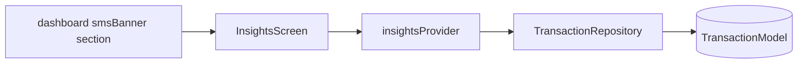

# Feature — Insights

## Purpose

Higher-level **spending trends** and insights — complementary to analytics with trend charts and summary cards. Read-only; aggregates from transactions via providers.

## Entry points

| Route | Screen |
|-------|--------|
| `/insights` | `InsightsScreen` |

Linked from dashboard `insightsSummary` section.

## Folder map

```text
lib/features/insights/
├── domain/
│   ├── models/insights_data.dart
│   └── providers/insights_providers.dart
└── presentation/
    ├── screens/insights_screen.dart
    └── widgets/spending_trend_chart.dart
```

## Key types

| Symbol | Description |
|--------|-------------|
| `InsightsData` | Trend points, comparisons |
| `insightsProvider` | Builds insights from transaction history |
| `SpendingTrendChart` | fl_chart line/area visualization |

## Data flow



## Dependencies

| Module | Relationship |
|--------|--------------|
| [transactions](transactions.md) | Source data |
| [dashboard](dashboard.md) | Entry from home |
| [analytics](analytics.md) | Related reporting surface |

## How to extend

### Add a new insight metric

1. Extend `InsightsData` with the computed field.
2. Compute in `insights_providers.dart` from repository queries.
3. Render in `InsightsScreen` or new widget.
4. Optionally surface on dashboard via `HomeSection.insightsSummary`.

## Tests

No dedicated insights unit tests — add when adding non-trivial calculations.

```bash
flutter test test/unit/transactions/transaction_repository_test.dart
```

## Related docs

- [analytics.md](analytics.md)
- [dashboard.md](dashboard.md)
