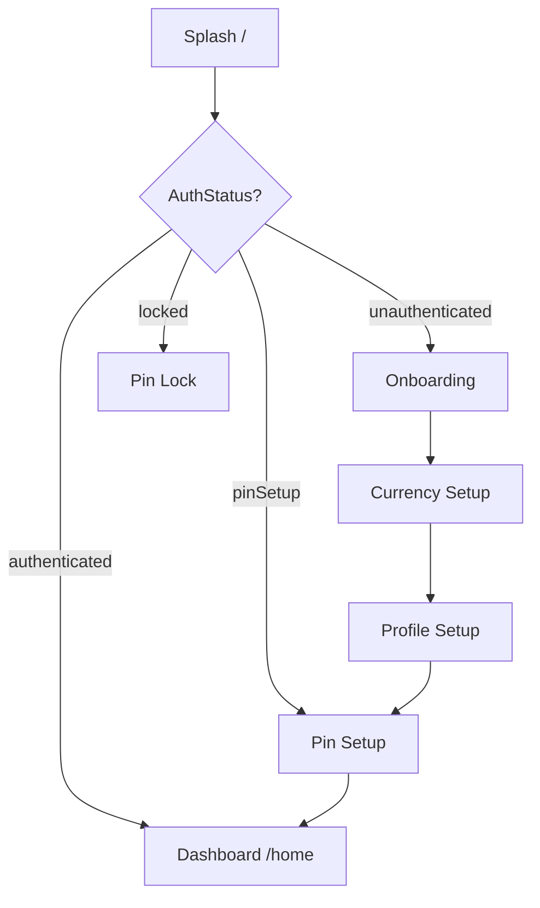

# Feature — Onboarding

## Purpose

First-run user experience: branded splash, marketing carousel, currency selection, and profile setup. Completing profile marks onboarding done and routes to PIN setup. Returning users skip directly based on `AuthStatus`.

## Entry points

| Route | Screen |
|-------|--------|
| `/` | `SplashScreen` |
| `/onboarding` | `OnboardingScreen` |
| `/onboarding/currency` | `CurrencySetupScreen` |
| `/onboarding/profile` | `ProfileSetupScreen` |

## Folder map

```text
lib/features/onboarding/
└── presentation/
    ├── splash_screen.dart
    ├── onboarding_screen.dart
    ├── currency_setup_screen.dart
    └── profile_setup_screen.dart
```

No local `data/` or `domain/` — delegates to auth datasource and providers.

## Key types

| Screen | Behavior |
|--------|----------|
| `SplashScreen` | Animation; routes by `authProvider` status |
| `OnboardingScreen` | 3-page carousel; Skip / Get Started → currency |
| `CurrencySetupScreen` | Searchable picker; saves via `AuthLocalDatasource` |
| `ProfileSetupScreen` | Name + avatar color → `completeOnboarding()` → PIN setup |

Currency list: [`currency_data.dart`](../../../lib/features/auth/data/currency_data.dart) (`kCurrencies`).

## Flow



All onboarding paths are **public** — router allows access without authentication.

## Main providers

Uses auth module only:

- `authProvider` — navigation decisions on splash
- `authDatasourceProvider` — save currency, profile
- `authProvider.notifier.completeOnboarding()` — end of profile setup

## Dependencies

| Module | Relationship |
|--------|--------------|
| [auth](auth.md) | All persistence and status transitions |
| [architecture/navigation-and-auth](../architecture/navigation-and-auth.md) | Public route list |

## How to extend

### Add an onboarding step

1. Create screen in `presentation/`.
2. Add route to `AppRoutes` / `app_router.dart` (public path list).
3. Wire navigation from previous step.
4. If persisting data, add fields to `AuthLocalDatasource`.
5. Update flow diagram in this doc.

Example: insert a step between currency and profile:

```dart
// profile_setup_screen.dart — navigate from currency step
context.go(AppRoutes.profileSetup);
```

## Tests

No dedicated onboarding widget tests today. Manual verification of full flow recommended after changes.

```bash
flutter test test/unit/auth/auth_provider_test.dart   # completeOnboarding
```

## Related docs

- [auth.md](auth.md)
- [../architecture/navigation-and-auth.md](../architecture/navigation-and-auth.md)
