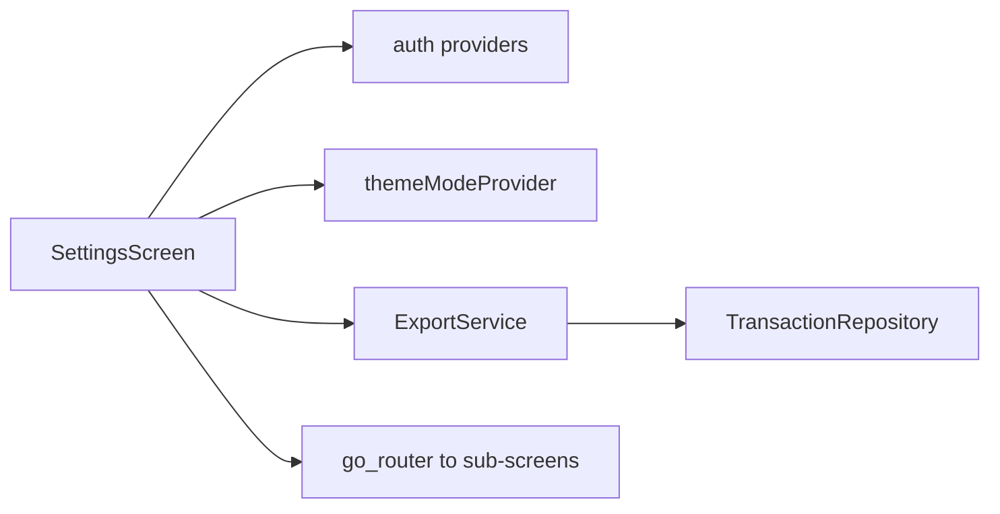

# Feature — Settings

## Purpose

App **settings hub**: profile edit, currency change, PIN change, biometric toggle, theme mode, data export (PDF/CSV), navigation to accounts/categories/import/reconciliation/home layout, and SMS settings links.

## Entry points

| Route | Screen |
|-------|--------|
| `/settings` | `SettingsScreen` (bottom nav tab 4) |

Sheets (not routes): `EditProfileSheet`, `ChangePinSheet`, `ChangeCurrencySheet`.

## Folder map

```text
lib/features/settings/
├── data/
│   └── export_service.dart
├── domain/
│   └── providers/settings_providers.dart
└── presentation/
    ├── screens/settings_screen.dart
    └── widgets/              # biometric_tile, edit_profile_sheet, change_pin_sheet, ...
```

## Key types

| Symbol | Description |
|--------|-------------|
| `ExportService` | PDF and CSV export of transactions |
| `themeModeProvider` | System/light/dark — read by `App` |
| `BiometricTile` | Enable/disable biometric unlock |
| `ChangePinSheet` | Uses `AuthConfig` + `authProvider` |

Export uses embedded **Noto Sans** for Unicode (₹) — see project rule on PDF unicode safety.

## Data flow



## Main providers

| Provider | Role |
|----------|------|
| `themeModeProvider` | Persisted theme preference |
| Settings-related | Profile/currency via auth datasource |

## Dependencies

| Module | Relationship |
|--------|--------------|
| [auth](auth.md) | PIN, profile, currency, biometrics |
| [transactions](transactions.md) | Export source, manage accounts/categories links |
| [import](import.md) | Import navigation |
| [dashboard](dashboard.md) | Home layout link |
| [sms](sms.md) | SMS settings link |
| [core/theme](../core/theme.md) | Theme application |

## How to extend

### Add a settings toggle

1. Add persistence to `AuthLocalDatasource` or dedicated prefs.
2. Add provider in `settings_providers.dart`.
3. Add `SwitchListTile` in `SettingsScreen`.
4. Test: `test/unit/settings/settings_providers_test.dart`.

### Add export format

Extend `ExportService` — load Unicode font on main isolate before `compute` for PDF.

## Tests

```bash
flutter test test/unit/settings/
flutter test test/widgets/biometric_tile_test.dart
```

## Related docs

- [auth.md](auth.md)
- [import.md](import.md)
- [transactions.md](transactions.md)
- [dashboard.md](dashboard.md)
