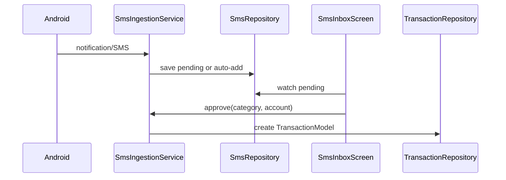

# Feature — SMS (UI & Persistence)

## Purpose

User-facing **SMS auto-detection** module: review pending parsed transactions, manage merchant→category rules, configure auto-add behavior, and grant notification-listener permission. Parsing logic lives in [core/sms](../core/sms/overview.md); this feature owns Isar persistence and screens.

## Entry points

| Route | Screen |
|-------|--------|
| `/sms/inbox` | `SmsInboxScreen` |
| `/sms/onboarding` | `SmsOnboardingScreen` |
| `/sms/settings` | `SmsSettingsScreen` |

Dashboard `smsBanner` links here when setup incomplete or items pending.

## Folder map

```text
lib/features/sms/
├── data/
│   ├── models/                    # sms_parsed_transaction, sms_rule_model, sms_raw_log_model
│   └── repositories/
│       └── sms_repository.dart
├── domain/
│   ├── models/sms_settings.dart
│   └── providers/sms_providers.dart
└── presentation/
    ├── screens/
    └── widgets/                   # new_merchant_sheet, sms_message_reference
```

## Key types

### Isar models

| Model | Purpose |
|-------|---------|
| `SmsParsedTransaction` | Parsed queue item (pending/approved/rejected) |
| `SmsRuleModel` | Merchant key → category rule |
| `SmsRawLogModel` | Optional raw SMS audit |

### SmsSettings (SharedPreferences)

| Field | Default | Notes |
|-------|---------|-------|
| `enabled` | true | Master switch |
| `autoAddMode` | `askAlways` | See auto-add modes below |
| `confidenceThreshold` | 75 | 0–100 |
| `detectSubscriptions` | true | Parser flag |
| `detectRefunds` | true | Parser flag |
| `showParseDebug` | false | Show signals in inbox |

Auto-add modes: `askAlways`, `autoAddKnown`, `silentAll` — evaluated by [`SmsAutoAddPolicy`](../core/sms/ingestion-and-policy.md).

## Data flow



## Main providers

| Provider | Role |
|----------|------|
| `smsRepositoryProvider` | `SmsRepository(isar)` |
| `smsPendingProvider` | Stream of pending items |
| `smsPendingCountProvider` | Badge count for dashboard |
| `smsRulesProvider` | Merchant rules stream |
| `smsSettingsProvider` | Load/save settings |
| `smsPermissionProvider` | Notification listener enabled |

## Dependencies

| Module | Relationship |
|--------|--------------|
| [core/sms](../core/sms/overview.md) | Parser, ingestion, policy |
| [transactions](transactions.md) | Approve creates transactions |
| [platform/android-sms-listener](../platform/android-sms-listener.md) | Native delivery |
| [dashboard](dashboard.md) | SMS banner |

## How to extend

### Add a settings toggle

1. Add field to `SmsSettings` with default + JSON key.
2. Update `SmsSettingsNotifier` load/save in `sms_providers.dart`.
3. Add switch in `SmsSettingsScreen`.
4. Wire into parser/ingestion if it affects parsing (`detectRefunds`, etc.).

### Add approve flow UI

Use `NewMerchantSheet` pattern — category pick + optional rule creation before calling `SmsIngestionService.approve`.

## Tests

```bash
flutter test test/unit/sms/
flutter test test/widgets/sms_message_reference_test.dart
```

Corpus regression: [../testing/sms-corpus.md](../testing/sms-corpus.md)

## Related docs

- [../core/sms/overview.md](../core/sms/overview.md)
- [../core/sms/ingestion-and-policy.md](../core/sms/ingestion-and-policy.md)
- [../core/sms/gap-analysis.md](../core/sms/gap-analysis.md)
- [transactions.md](transactions.md)
- [../platform/android-sms-listener.md](../platform/android-sms-listener.md)
