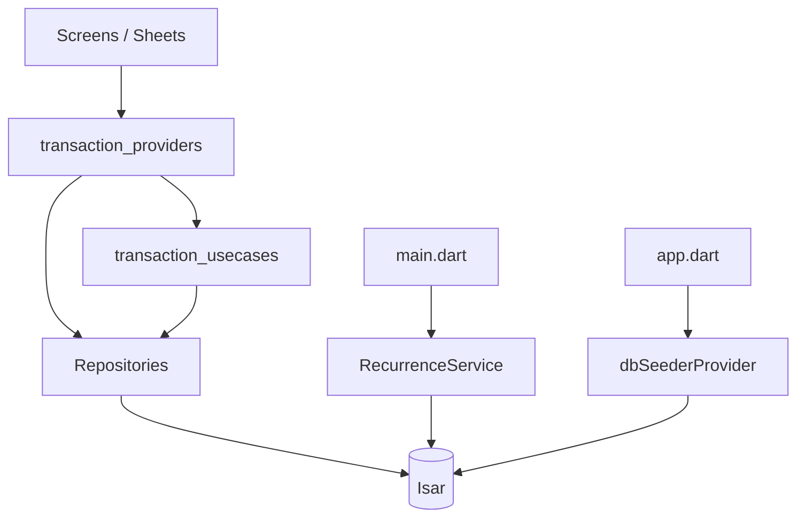

# Feature — Transactions

## Purpose

Core ledger module: **transactions**, **categories**, and **accounts** stored in Isar. Provides CRUD use cases, filtered live lists, account balances, **reconciliation**, **recurring transactions**, and default seed data on first launch.

> **Categories** live here — not in `lib/features/categories/` (empty placeholder).

## Entry points

| Route | Screen |
|-------|--------|
| `/transactions` | `TransactionsScreen` |
| `/settings/categories` | `ManageCategoriesScreen` |
| `/settings/accounts` | `ManageAccountsScreen` |
| `/settings/accounts/:id` | `AccountDetailScreen` |
| `/settings/reconciliation` | `ReconciliationScreen` |

Add/edit transaction: **`AddTransactionSheet`** (modal, not a route).

## Folder map

```text
lib/features/transactions/
├── data/
│   ├── models/              # transaction_model, category_model, account_model
│   ├── repositories/        # transaction, category, account
│   └── seed/                # default_categories, default_accounts
├── domain/
│   ├── providers/           # transaction_providers.dart
│   ├── usecases/            # transaction_usecases.dart
│   └── services/            # recurrence_service, recurrence_calculator
└── presentation/
    ├── screens/
    └── widgets/             # tile, filter chips, add/edit sheets
```

## Key types

### Models (Isar)

| Model | Highlights |
|-------|------------|
| `TransactionModel` | amount, categoryId, accountId, date, isIncome, recurrence, soft delete, multi-currency |
| `CategoryModel` | name, icon, color, income/expense type |
| `AccountModel` | name, type, isDefault, balance tracking |

### Repositories

- `TransactionRepository` — watch, CRUD, totals, period summaries
- `CategoryRepository` — category CRUD + streams
- `AccountRepository` — account CRUD + streams

### Use cases

`AddTransactionUseCase`, `EditTransactionUseCase`, `DeleteTransactionUseCase`, `GetCategorySummaryUseCase`

### Recurrence

| Component | Role |
|-----------|------|
| `RecurrenceType` | none, daily, weekly, monthly, yearly |
| `RecurrenceCalculator` | Pure date math, month-end clamping |
| `RecurrenceService` | Startup materialization in `main.dart` |

Template rows keep recurrence; generated instances have `RecurrenceType.none`.

## Data flow



## Main providers

| Provider | Role |
|----------|------|
| `transactionRepositoryProvider` | Repository instance |
| `categoryRepositoryProvider` | Category repository |
| `accountRepositoryProvider` | Account repository |
| `transactionListProvider` | Filtered transaction stream |
| `transactionFilterProvider` | Active filter state |
| `categoriesProvider` / `accountsProvider` | Lists |
| `dbSeederProvider` | First-launch defaults |
| `accountBalanceProvider` | Computed balance |
| `reconciliationStateProvider` | Reconciliation workflow |

## Dependencies

| Module | Relationship |
|--------|--------------|
| [auth](auth.md) | `currencyCodeProvider` for totals |
| [core/database](../core/database.md) | `isarProvider` |
| [dashboard](dashboard.md) | Balance, recent txs |
| [sms](sms.md) | Approve → creates `TransactionModel` |
| [import](import.md) | Bulk insert |
| [analytics](analytics.md) | Reads summaries |
| [budgets](budgets.md) | Category linkage |

## How to extend

### Add a transaction field

1. Add property to `TransactionModel`.
2. Run `build_runner`.
3. Update repository write paths and `AddTransactionSheet`.
4. Add test in `transaction_repository_test.dart`.

### Add a filter chip

1. Extend `TransactionFilter` model in providers.
2. Update `transactionListProvider` query.
3. Add chip UI in `transaction_filter_chips.dart`.
4. Test: `test/widgets/transaction_filter_chips_test.dart`.

### Add a default category

Edit `data/seed/default_categories.dart` — seeder runs once via `dbSeederProvider`.

## Tests

```bash
flutter test test/unit/transactions/
flutter test test/widgets/transaction_tile_test.dart
flutter test test/widgets/transaction_filter_chips_test.dart
flutter test test/widgets/reconciliation_screen_test.dart
```

## Related docs

- [../architecture/data-model.md](../architecture/data-model.md)
- [dashboard.md](dashboard.md)
- [sms.md](sms.md)
- [import.md](import.md)
