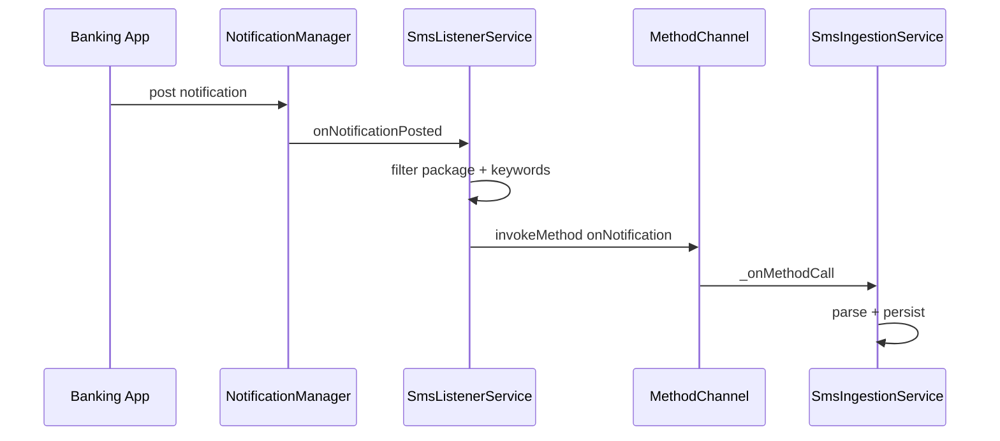

# Platform — Android SMS Listener

## Purpose

Android-native layer that captures **banking and payment app notifications** (and optionally **SMS inbox**) and forwards them to Flutter via a **MethodChannel** for parsing and persistence.

## Entry points

| File | Role |
|------|------|
| [`MainActivity.kt`](../../../android/app/src/main/kotlin/com/rapps/moneymanager/MainActivity.kt) | Channel setup, SMS inbox sync, `FLAG_SECURE` |
| [`SmsListenerService.kt`](../../../android/app/src/main/kotlin/com/rapps/moneymanager/SmsListenerService.kt) | `NotificationListenerService` |
| [`AndroidManifest.xml`](../../../android/app/src/main/AndroidManifest.xml) | Service declaration, permissions |

Dart counterpart: [`SmsIngestionService`](../../../lib/core/sms/sms_ingestion_service.dart)

Channel name: `com.rapps.moneymanager/sms` — must match [`AppConfig.smsMethodChannel`](../../../lib/core/constants/app_config.dart).

## Architecture



## MainActivity responsibilities

| Feature | Implementation |
|---------|----------------|
| `FLAG_SECURE` | Blocks task-switcher/recording snapshots (Android) |
| Method channel | Registers handler for Dart → native calls |
| `syncSmsInbox` | `READ_SMS` permission + content resolver query (90-day window) |
| Permission flow | `READ_SMS_REQUEST_CODE = 4217` |

## SmsListenerService responsibilities

| Feature | Implementation |
|---------|----------------|
| Notification access | User must enable in Settings → Notification Access |
| Package filter | `trustedPackages` set (HDFC, ICICI, SBI, GPay, PhonePe, …) |
| Keyword filter | debited, credited, UPI, ₹, etc. |
| Forward to Flutter | Uses static `channel` reference set by MainActivity |
| `syncActiveNotifications` | Backfill from active status bar notifications |

## MethodChannel API

| Method | Direction | Purpose |
|--------|-----------|---------|
| `isNotificationListenerEnabled` | Dart → Kotlin | Check listener permission |
| `openNotificationSettings` | Dart → Kotlin | Open system settings |
| `syncActiveNotifications` | Dart → Kotlin | Backfill notifications |
| `syncSmsInbox` | Dart → Kotlin | Read SMS (`limit` arg) |
| `onNotification` (or similar) | Kotlin → Dart | New notification payload |

Exact inbound method name: see handler in `SmsIngestionService._onMethodCall`.

## Permissions

| Permission | Purpose |
|------------|---------|
| Notification listener | Required for live detection |
| `READ_SMS` | Optional inbox backfill via `syncSmsInbox` |

## Privacy

- iOS uses in-app privacy overlay; Android uses `FLAG_SECURE`.
- Parsed SMS pruned on app resume ([bootstrap doc](../architecture/bootstrap-and-lifecycle.md)).
- Raw SMS redaction in parser: `TransactionParser.redactSensitive`.

## Dependencies

| Module | Relationship |
|--------|--------------|
| [../core/sms/ingestion-and-policy.md](../core/sms/ingestion-and-policy.md) | Dart handler |
| [../features/sms.md](../features/sms.md) | UI and settings |
| [../core/constants.md](../core/constants.md) | Channel name contract |

## How to extend

### Add a trusted banking app package

Add package ID to `trustedPackages` in `SmsListenerService.kt`:

```kotlin
private val trustedPackages = setOf(
    // existing...
    "com.newbank.app",
)
```

Test with a real notification from that app or a manual `onNotificationPosted` test.

### Add a new native method

1. Handle in `MainActivity.configureFlutterEngine` `when (call.method)`.
2. Add Dart caller in `SmsIngestionService`.
3. Update this doc and [ingestion-and-policy.md](../core/sms/ingestion-and-policy.md).

## Tests

Platform code: manual device testing. Dart side:

```bash
flutter test test/unit/sms/
```

## Related docs

- [../core/sms/ingestion-and-policy.md](../core/sms/ingestion-and-policy.md)
- [../features/sms.md](../features/sms.md)
- [android-build-notes.md](android-build-notes.md)
